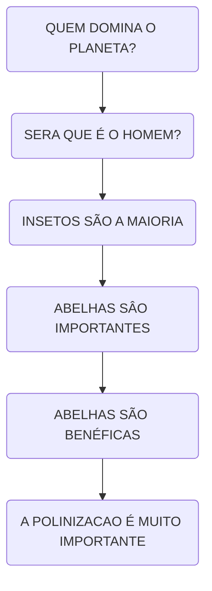
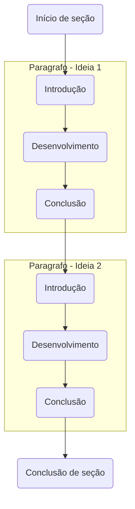

# Rúbrica para Portfólios do Quinto e Sexto Período

Este documento tem como objetivo orientar a elaboração do Portfólio Acadêmico, que deve ser entregue nos quinto e sexto períodos do curso.

As informações aqui apresentadas foram organizadas para auxiliar na confecção do Relatório Portfólio de Projetos, de forma clara, objetiva e alinhada ao modelo oficial disponibilizado, garantindo que o conteúdo do portfólio seja construído de maneira mais assertiva e padronizada.

As dicas e observações descritas serão avaliadas pelos professores orientadores, `Prof. Leonardo` e `Prof. Esdras`, facilitando o atendimento aos critérios de correção e a criação de um padrão de documentação entre os alunos.

Este material é dinâmico e evolutivo. Atualizações poderão ocorrer conforme a necessidade e serão comunicadas via Teams ou em sala de aula.

---

## DICAS

As orientações a seguir foram elaboradas com base no modelo oficial de portfólio.
Em caso de dúvidas ou sugestões de melhoria, entre em contato com os professores responsáveis.

---

### Título

O título é o **primeiro contato do leitor** com o seu portfólio. Deve ser simples, completo e preferencialmente curto — entre 10 e 20 palavras, quando possível.

#### Exemplo com título e subtítulo segmentados:

> **Título:** Aplicação móvel LINCEU
> **Subtítulo:** Canal de comunicação comunitária destinada às Guardas Municipais

Caso deseje um título mais completo, siga os exemplos abaixo:
* **SYMo: Aplicativo de Gestão Financeira Pessoal**
* **Análise e Desenvolvimento de um Aplicativo Móvel para Gestão de Finanças Pessoais: SYMo**
* **Aplicativo Móvel SYMo: Estudo de Caso para Auxílio à Gestão Financeira Pessoal**

O uso de subtítulo é **opcional**, mas pode enriquecer o contexto do projeto.

---

### Resumo

O resumo é o **cartão de visitas do trabalho**. Ele deve apresentar, de forma concisa, os principais aspectos do portfólio.
Inclua os seguintes elementos, sem subdividir em parágrafos:
1. Introdução (até duas frases);
2. Objetivo;
3. Materiais e método;
4. Resultados;
5. Discussão e conclusão.

> O resumo deve ter entre **200** e **300 palavras**, ser escrito em terceira pessoa e em linguagem impessoal.
É a parte mais lida do trabalho, portanto, capriche!
Normalmente, o resumo é a última parte escrita, pois resume o conteúdo já finalizado.

---

### Abstract

O **Abstract** é a **tradução do resumo** para o inglês.
Siga a mesma estrutura e mantenha o tamanho entre **200 e 300 palavras**.

---

### Palavras-chave

As palavras-chave auxiliam na indexação e pesquisa de trabalhos acadêmicos.

Utilize de **3 a 6 palavras-chave**, separadas por ponto e vírgula.
Quanto menos termos, mais específica será a busca.

---

### Introdução

A introdução é uma contextualização teórica e prática do tema.
Recomenda-se um texto entre **400 e 800 palavras**, estruturado em formato de **CONE INVERTIDO**, ou seja, partindo de uma visão geral para uma abordagem específica.

* Prefira citações indiretas (paráfrases).
* Evite “apud”.
* Em breve, incluiremos links diretos para as principais normas e referências utilizadas.

A introdução deve conter:
1. **Presente e Contextualização** – descreva o cenário atual e a importância do tema;
2. **Passado** – apresente o que já foi feito sobre o assunto;
3. **Futuro** – indique perspectivas ou soluções relacionadas ao seu projeto.

---

### Estruturação de Parágrafos

A escrita acadêmica deve ser **técnica e objetiva**, sem subjetividade.
Seu portfólio será apresentado publicamente, portanto a linguagem precisa ser **formal, técnica e clara**.

Um texto bem estruturado guia o leitor de forma lógica, com ideias conectadas e progressão de raciocínio.

#### O que é um parágrafo?

É um conjunto de frases que expressa uma **ideia principal**, podendo se conectar a outras ideias do texto.

> Cada parágrafo deve cumprir uma função: **introduzir**, **desenvolver** e **concluir uma ideia**.

#### Exemplo de estrutura CONE INVERTIDO:
Começa com uma ideia ampla e vai se tornando mais específica até o ponto central — excelente para textos científicos.

Leia o paragrafo abaixo.

> Quem domina nosso planeta? Provavelmente a primeira resposta à pergunta seria o homem ou, talvez, os peixes, que estão presentes nos rios lagos, oceanos... Os insetos são mais as abundantes criaturas do nosso planeta... A abelha **é um inseto muito comum e é um dos mais importantes seres para o homem**; seu **grande valor** não é apenas por seu produtos: **mel**, **pólen**, **própolis**, geleia real, cera e apitoxia (**veneno**) mas, **principalmente a polinização**.

No exemplo acima para justificar a importancia das abelhas, foi usada a técnica de **cone invertido**, note que o texto começa com uma ideia ampla e vai se tornando mais específica até o ponto central.

> Analise o parágrafo acima e veja como ele se conecta lógicamente e de forma clara.

Seguindo esta estrutura, o texto se conecta lógicamente e de forma clara.

Assim podemos seccionar as seçoes de nosso documento de forma lógica e clara.

#### Dicas práticas:
1.	Introdução: Frase principal que apresenta a ideia central.
2.	Desenvolvimento: Duas ou três frases que exploram a ideia.
3.	Conclusão: Fechamento que conecta com o próximo parágrafo.

Pense nos parágrafos como “funções de um algoritmo”: cada um entrega uma parte da solução até o fechamento da seção.

Cada seçao poderia ser como um módulo de um algoritmo que internamente possui sub-modulos e em linhas gerais todos os modulo cooperam entre si.

---

### Materiais e Métodos (ou Metodologia)

No modelo, esta parte aparece como **“Métodos, Ferramentas e Relato do Processo”** — todos equivalentes.

É a seção **mais detalhada** do portfólio, com cerca de **600 a 900 palavras**.

**Descreva**:
* As ferramentas utilizadas (softwares, frameworks, linguagens, TICs etc.);
* O ambiente de desenvolvimento;
* As metodologias aplicadas (como Scrum ou Kanban).
* Use sempre verbos no passado: “utilizou-se”, “foi aplicado”, “foi conduzido” etc.
Cite metodologias ágeis e frameworks como Design Thinking quando pertinente.

#### Métodos

Os métodos representam o **passo a passo técnico e lógico** que orientou a execução do seu projeto. É por meio deles que o leitor compreende como o **trabalho foi conduzido**, quais decisões metodológicas foram tomadas e **como os resultados foram alcançados**.

> Em outras palavras: os métodos são o “caminho” percorrido para chegar ao resultado final. Eles devem ser descritos com clareza suficiente para que outro profissional da área consiga reproduzir seu processo e obter resultados semelhantes, caso deseje.

Busque o **equilíbrio entre o detalhamento e a objetividade** — o suficiente para demonstrar o rigor técnico, sem tornar a leitura cansativa.

Cite as metodologias e frameworks utilizados (como Scrum, Kanban ou Design Thinking), sempre de forma coerente com o contexto do projeto.

---

Os métodos devem ser detalhados, mas não excessivamente.

Devemos considerar que pessoas de nossa área poderão entender e repetir os métodos descritos para reprodução dos mesmos resultados, se desejarem repetir os seus métodos.

O meio termo entre o nível de informação para um leigo e uma pessoa de área é complexo no inicialmente, não podemos negar, mas cabe a nós o bom senso de não omitir passos importantes para os leitores da área e não detalhar demais para os leigos.

Não há uma fórmula mágica para este equilíbrio, então — como o maior expert do portfólio é você — vamos tentar juntos encontrá-lo, lapidando excessos e incrementando pontos de melhoria.

Afinal, neste ponto, seu trabalho já está concluído, e estamos buscando destacar seu significado, adequando-o aos aspectos importantes dos trabalhos acadêmicos.

> 💡 Pulo do gato: As metodologias ágeis já são amplamente conhecidas, portanto, cite-as brevemente, mencionando o modelo adotado (ex.: Scrum ou Kanban) e incluindo a referência completa na seção de Referências. Assim, você demonstra domínio conceitual sem sobrecarregar o texto com descrições longas.

#### Subtítulos

Podem ser usados para dividir etapas e tornar o texto mais compreensível.

---

### Resultados

Apresente os **resultados obtidos** com o desenvolvimento dos projetos.

Como o modelo não exige a formulação de objetivos específicos, destaque os benefícios e contribuições alcançados.

Recomenda-se entre **400 e 500 palavras**.
Inclua **imagens**, **gráficos** ou **tabelas** para fortalecer sua argumentação e facilitar a compreensão.

---

### Considerações

As **considerações finais** devem refletir sobre os resultados obtidos e os aprendizados adquiridos durante o desenvolvimento dos projetos.

Inclua também **possíveis desdobramentos futuros**, caso haja continuidade do trabalho.

> Esta seção tem um caráter mais reflexivo do que técnico, portanto valorize a clareza e a objetividade, sem se preocupar com número de linhas fixo.
